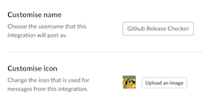

# Github Release Checker
Send a notification to slack counting the number of commits the default branch (main/master) is behind the tag 'prod'

## Prerequisites
- On release to production, the git-sha should be tagged as `prod` by your CI/CD pipeline (can be overwritten)
- Designed to be ran as a cron job.

## Usage
1. Add the [incoming webhooks](https://slack.com/apps/A0F7XDUAZ) slack integration and configure with a name and icon.

2. Generate a new [Github Personal Access Token](https://github.com/settings/tokens)  
Note: `Github Release Checker`  
Expiration: `No Expiration`  
Scopes: `repo:status`

3. Set environment variables:
`GITHUB_USER` OR `GITHUB_ORGANISATION` (Only set one)
`GITHUB_TOKEN`  
`GITHUB_TAG` (if you want to override from prod)
`SLACK_WEBHOOKURL`

## TODO:
(x) Tests
(x) Build and push to dockerhub